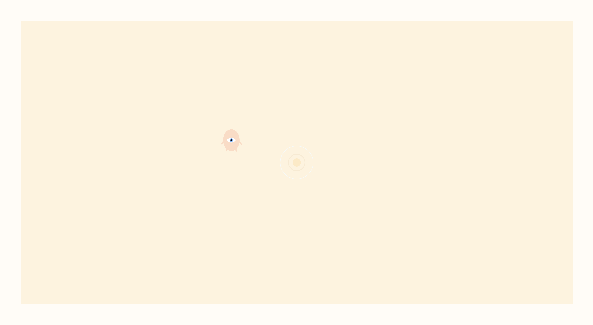

# Reinforcement agent [(Ra)](https://lunarbaby.ml)



Ra is a q-learning agent that exists in your browser. The reward at every time
step is negatively correlated with Ra's distance to the cursor. The only feature
of its environment it has access to is its distance to the concentric circles.

In the current iteration of this agent, here are the q-learning parameters:

```javascript
this.epsilon = 0.2;
this.discount = 0.8;
this.alpha = 0.3;
```

When you open the page, Ra starts updating a fundamental rule set of its
environment. When you close the page, it forgets.

Made with `paper.js`.
Inspired by [otoro.net](https://otoro.net/).
